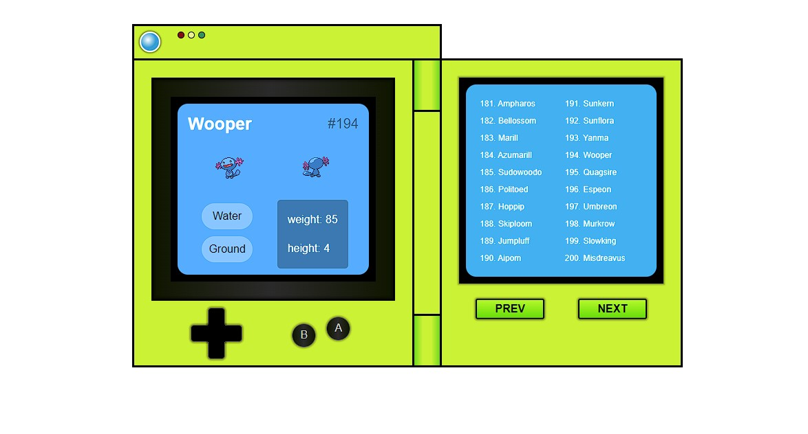

# pokedex-andrebrito

<h1> Pokedex </h1>

<h3> Projeto De Pokedex feito em HTML, CSS, e JavaScript Vanilla</h3>

 Tirei como referência para esse projeto a <a href="https://www.youtube.com/watch?v=wXjSaZb67n8">vídeo aula</a> do canal "Justin Kim". Vídeo no qual o autor foi super didático e bemn explicativo, me diverti tendo essa experiência no desenvolvimento do código.

<Strong>Descrição:</Strong> O app se trata de uma pokedex na qual é possivel selecionar e vizualizar os pokemons, ver seu tipo, nome, id, peso e altura. Foi consumida a Api "pokeapi" para a criação do aplicativo.

